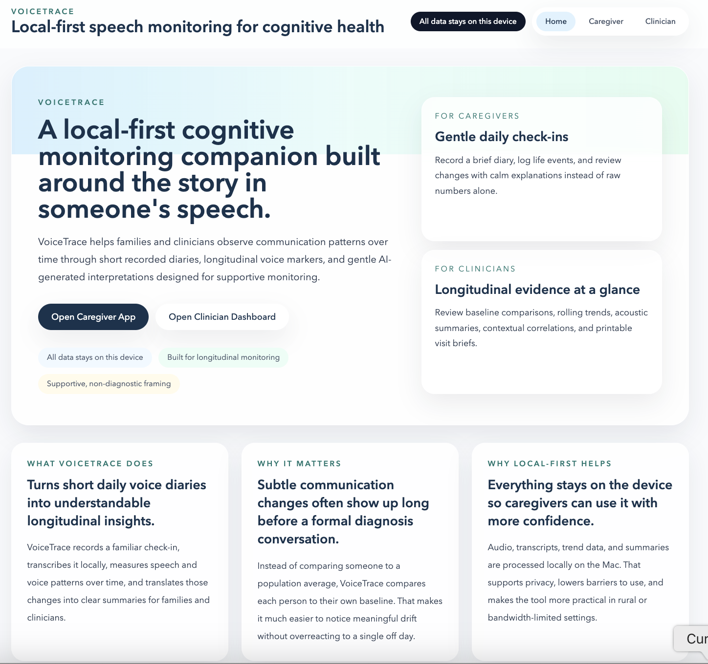

# VoiceTrace

VoiceTrace is a local-first longitudinal cognitive communication monitoring platform designed for families and rural clinicians who need a practical way to notice meaningful speech-pattern changes over time. It combines guided voice diaries, transcription, linguistic and acoustic marker extraction, contextual life-event journaling, caregiver-friendly AI insights, and clinician-ready summaries while keeping audio, transcripts, and trend data on the device.



## What VoiceTrace Does

VoiceTrace now supports:

- A polished landing page that introduces the product before users enter the caregiver or clinician experience
- Caregiver patient profile creation and daily voice diary recording
- Local Whisper transcription for recorded audio
- Gemma-powered linguistic marker extraction through Ollama
- Deterministic longitudinal insights that compare each person to their own baseline
- Acoustic marker analysis including pace, pauses, energy, and pitch variability
- Explainability snippets under session scores, such as filler-word counts and transcript evidence
- Life event journaling for sleep, stress, illness, medication changes, meals, social activity, and doctor visits
- Correlation insights that connect changes in speech patterns with recent life events using cautious “associated with” language
- Daily reflection prompts with prompt category rotation and optional freeform mode
- Caregiver dashboards with charts, weekly summaries, confidence messaging, and contextual explanations
- Clinician dashboards with rolling trends, acoustic summaries, baseline comparison, pre-appointment briefs, referral letters, and PDF export

## Why It Is Useful

- It compares each person to their own historical baseline rather than a population average.
- It translates graphs and scores into plain-language observations for caregivers.
- It helps clinicians review longitudinal evidence, not just a single encounter.
- It keeps all processing local, which is especially helpful for privacy-sensitive and rural care settings.

## Prerequisites

- Python 3.11+
- Node.js 18+
- Ollama installed locally
- `gemma4` available in Ollama

## Setup

1. Pull the local Gemma model:

```bash
ollama pull gemma4
```

Fallback if needed:

```bash
ollama pull gemma3:27b
```

2. Create and activate a virtual environment:

```bash
python3 -m venv .venv
source .venv/bin/activate
```

3. Install backend dependencies:

```bash
pip install -r requirements.txt
```

4. Create your local environment file:

```bash
cp .env.example .env
```

The default `.env` expects:

- `OLLAMA_BASE_URL=http://localhost:11434`
- `OLLAMA_MODEL=gemma4:latest`
- `OLLAMA_FALLBACK_MODEL=gemma3:27b`

5. Seed demo data:

```bash
python -m backend.seed_data
```

6. Start the backend:

```bash
uvicorn backend.main:app --reload
```

7. Start the frontend:

```bash
cd frontend
npm install
npm run dev
```

8. Open the app:

- Frontend: [http://localhost:5173](http://localhost:5173)
- Backend health check: [http://localhost:8000/health](http://localhost:8000/health)

## Running Day To Day

Once everything is installed, you usually only need two terminals.

Backend:

```bash
cd "/Users/tanyagoel101/Downloads/Gemma4Good Hackathon"
source .venv/bin/activate
uvicorn backend.main:app --reload
```

Frontend:

```bash
cd "/Users/tanyagoel101/Downloads/Gemma4Good Hackathon/frontend"
npm run dev
```

Keep Ollama running in the background. If analysis is slow on the first run, the local models may still be warming up.

## Architecture

```text
┌───────────────────────────────────────────┐
│                 React SPA                 │
│ Landing Page + Caregiver + Clinician UI  │
└───────────────────┬───────────────────────┘
                    │ Axios / fetch
┌───────────────────▼───────────────────────┐
│              FastAPI Backend              │
│ async routers + services + health checks  │
└───────┬──────────────┬──────────────┬──────┘
        │              │              │
        │              │              ├───────────────────────┐
        │              │                                      │
┌───────▼────────┐ ┌───▼────────────────┐            ┌────────▼─────────┐
│   SQLite DB    │ │ faster-whisper     │            │ Ollama + Gemma 4 │
│ patients       │ │ local transcription│            │ local LLM analysis│
│ sessions       │ └────────────────────┘            └──────────────────┘
│ weekly summaries│
│ life events    │
└───────┬────────┘
        │
┌───────▼─────────────────────────────────────────────────────┐
│ Deterministic Intelligence Layer                            │
│ trends + insights + prompts + alerts + correlations +      │
│ transcript evidence + acoustic marker interpretation        │
└─────────────────────────────────────────────────────────────┘
```

## Core Monitoring Signals

### Six Linguistic Markers

1. `ttr_score`
Meaning: vocabulary variety.
Lower scores over time can indicate narrowing word choice.

2. `mlu_score`
Meaning: sentence complexity.
Shorter average sentences can be worth monitoring longitudinally.

3. `filler_density`
Meaning: frequency of filler phrases such as “um” or “you know.”
Rising filler use can reflect more effortful speech.

4. `idea_density`
Meaning: how much information is packed into the story.
Lower scores can mean fewer concrete ideas or facts.

5. `referential_cohesion`
Meaning: how often vague references are used compared with specific naming.
Higher ratios can make speech less specific.

6. `semantic_coherence`
Meaning: how well the narrative stays on track and reaches a clear point.
Lower scores can reflect more fragmented storytelling.

### Acoustic Markers

VoiceTrace also extracts local audio-derived signals, including:

- `words_per_minute`
- `average_pause_duration`
- `pause_frequency`
- `speech_tempo_variability`
- `vocal_energy`
- `pitch_variability`
- `jitter`
- `shimmer`

These support pace, prosody, hesitation, and voice-stability tracking over time.

## Product Experiences

### Landing Page

- Explains what VoiceTrace is, what it does, and why local-first monitoring matters
- Routes users into caregiver or clinician workflows

### Caregiver Experience

- Create new patient profiles
- Record daily diaries with a waveform recorder
- Use a guided daily reflection prompt or freeform mode
- Review plain-language session summaries and evidence snippets
- Log life events through a caregiver-friendly journal form
- View trend charts, confidence messaging, and contextual timeline insights

### Clinician Experience

- Review a multi-patient dashboard
- Compare current scores to baseline and rolling trends
- Read clinician-facing insights and acoustic summaries
- Generate pre-appointment briefs, referral letters, and PDFs

## API Highlights

VoiceTrace includes endpoints for:

- `/health`
- `/api/patients`
- `/api/patients/{patient_id}/sessions`
- `/api/patients/{patient_id}/baseline`
- `/api/patients/{patient_id}/weekly-summary`
- `/api/patients/{patient_id}/events`
- `/api/patients/{patient_id}/correlations`
- `/api/prompts/daily/{patient_id}`
- `/api/recordings/upload-blob`
- `/api/clinician/patients`
- `/api/clinician/patients/{patient_id}/brief`
- `/api/clinician/patients/{patient_id}/referral`
- `/api/reports/{patient_id}/pdf`

## Development Notes

- The backend is async throughout and uses SQLite with lightweight in-place schema migration on startup.
- Audio files are written only temporarily for transcription and acoustic analysis, then deleted.
- The frontend blocks new AI analysis actions when Ollama or the target Gemma model is unavailable and shows setup guidance instead.
- The recording upload flow uses a raw blob endpoint for better local browser reliability.
- Local analysis can take time on first run while Whisper and Gemma warm up. The frontend currently allows up to 240 seconds for a recording analysis request.
- The app is designed so trend interpretation, insights, prompts, alerts, and correlation summaries do not rely entirely on Gemma latency.

## Privacy And Safety

- All processing is designed to run locally on the device.
- Caregiver-facing language is intentionally warm and non-alarming.
- Clinician-facing views remain more detailed but still cautious.
- Correlation findings are framed as associations, not causes.
- Reports and dashboards include supportive, non-diagnostic framing.

## Disclaimer

This system monitors longitudinal communication patterns and is intended for supportive observational use only. It is not a diagnostic tool, does not replace clinical judgment, and any AI-generated briefs or referral text require physician review before use.

## Links

- Live Demo: _TBD_
- Video: _TBD_
- Kaggle Writeup: _TBD_

## Credits And Research

- DementiaBank corpus
- Snowdon et al. nun study on idea density
- Iris Murdoch linguistic analysis studies
- HRSA reporting on rural specialist shortages
